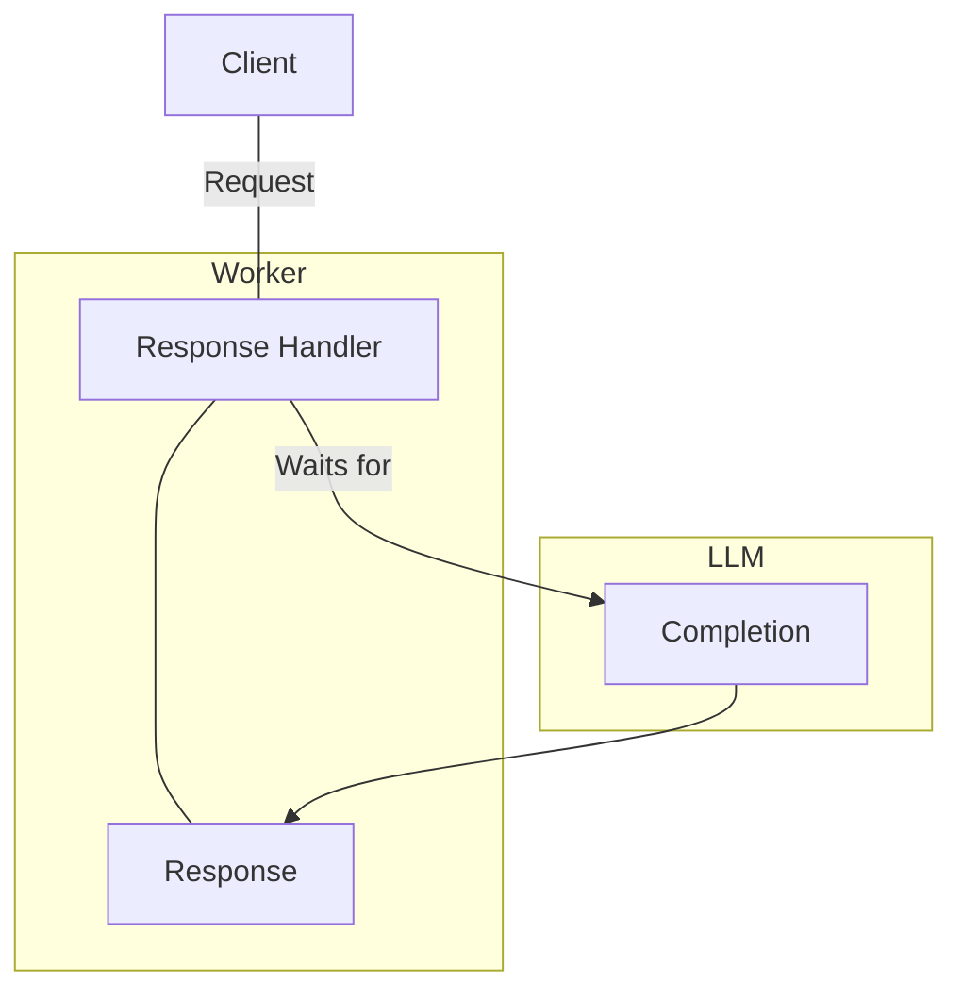

# Long-Running

In web development, there are two primary application models:

1. Long-running processes (for example, a web application written in `Go` that keeps running and the same process responds to multiple incoming requests)
2. Worker-based, single-threaded, synchronous (for example, `PHP` with `FPM`, `Ruby`, and some `Python` setups - it is generally used by scripted languages)

It is not necessarily connected to a specific language (for example, `PHP` can also start a long-running process with a web server, but most `PHP` frameworks were not designed with that application model in mind and without extensions like [Swoole](https://swoole.com/), it won't be preemptive). 

Python can run synchronously with some frameworks and `WSGI`, but it can also be run as a long-running application with ASGI or projects like [Granian](https://github.com/emmett-framework/granian).

## The Problem with the Worker-Based Synchronous Model

We will use PHP-FPM as an example. On [Debian](https://www.debian.org/), it comes preconfigured with the `max_children` parameter set to `5` by default, which means it can spawn at most 5 workers and handle at most 5 requests in parallel. This parameter can be tweaked, and under normal circumstances, it can be changed to a much higher value at the cost of RAM memory used.

Let's assume we have 32 workers running. Normally, the time to respond to a request takes at most milliseconds, and this runtime model is not an issue, but working with LLMs or ML models turns that around. Typical requests to LLM can take multiple seconds to complete, sometimes 20-30 seconds, depending on the number of tokens to be generated. That means if we have 32 requests in parallel to our application (which is not a lot), all the synchronous PHP workers can be blocked while waiting for tokens to be generated. 

We can end up in a situation where our server's CPU is almost idling, but it can't accept more requests due to an [Input/Output](/general-concepts/input-output) bottleneck.

While the tokens are generated, the worker is at a standstill and cannot accept additional requests.

## The Solution

The solution is to use languages and frameworks that support long-running processes (that do not rely on spawning workers) and with any form of asynchronicity.

The perfect example of such language is `Go` with its [goroutines](https://go.dev/tour/concurrency/1). Each goroutine uses just a few kilobytes of memory, and a server with a few gigabytes of RAM can potentially spawn millions of them. They run asynchronously and are preemptive, so there shouldn't be a situation where just a few requests can exhaust the entire server capacity.
