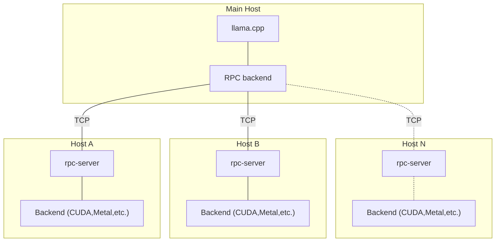

# Forward Proxy

A forward proxy is an intermediary server between the client and the origin server. Clients connect to the forward proxy server and request a resource (such as a completion) available on a different server that is otherwise inaccessible to them. The forward proxy server retrieves the resource and forwards it to the client.

You can combine both forward proxy and [reverse proxy](/general-concepts/load-balancing/reverse-proxy) to create a [gateway](/general-concepts/load-balancing/gateway).

## llama.cpp Forward Proxy

llama.cpp implements it's own [forward proxy](https://github.com/ggerganov/llama.cpp/tree/148ec970b62c3c5ae0a8bfdaad2fc237aaae350d/examples/rpc) in the form of RPC server. 

It puts the `llama.cpp` server in form of multiple backends and distributes requests among them.

<em>
source: <a 
    href="https://github.com/ggerganov/llama.cpp/tree/148ec970b62c3c5ae0a8bfdaad2fc237aaae350d/examples/rpc"
>llama.cpp repository</a>

